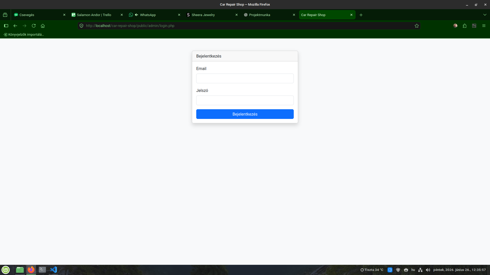
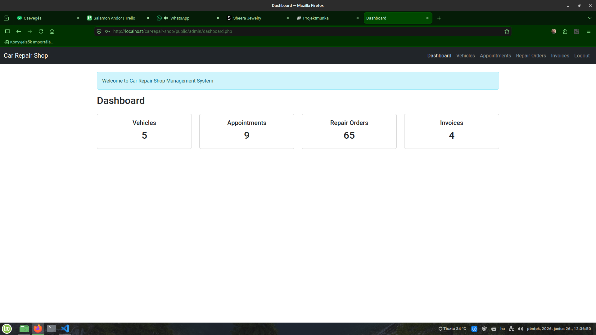
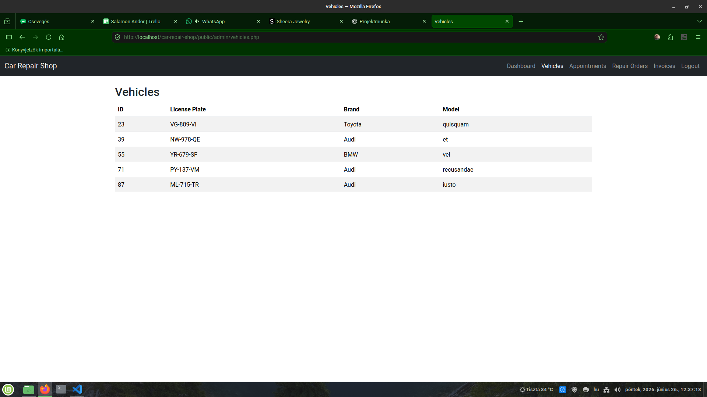
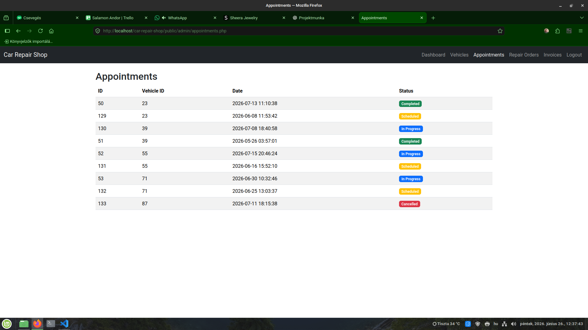
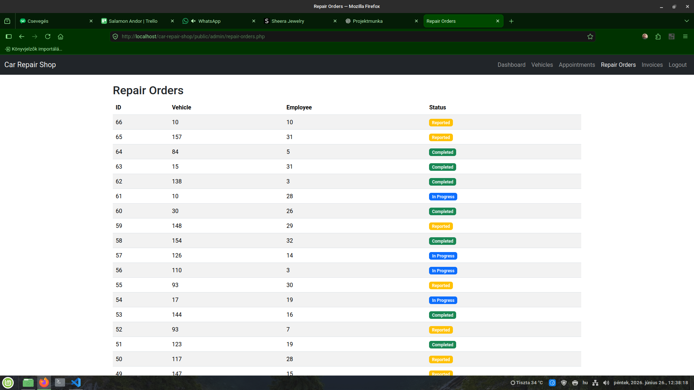
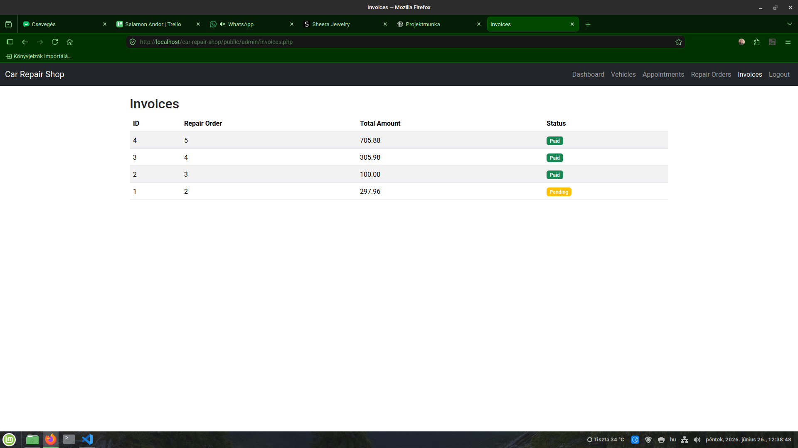

# Car Repair Shop

Ez a projekt a következő témát tartalmazza: Webes rendszer egy autószerviz működésének kezelésére.

## Technológiák

- PHP 8.3
- MariaDB
- Composer
- JWT
- PHPMailer
- Mobile Detect
- Faker

## Telepítés

1. composer install
2. adatbázis import
3. .env létrehozása

## API Endpointok

### Authentication

- POST /api/auth/register
- POST /api/auth/login
- POST /api/auth/logout
- POST /api/auth/forgot-password
- POST /api/auth/reset-password

### Vehicles

- POST /api/vehicles
- GET /api/vehicles
- GET /api/vehicles/{id}
- PUT /api/vehicles/{id}
- DELETE /api/vehicles/{id}

### Appointments

- POST /api/appointments
- GET /api/appointments
- PATCH /api/appointments/{id}

### Repair Orders

- POST /api/repair-orders
- GET /api/repair-orders
- GET /api/repair-orders/{id}
- PATCH /api/repair-orders/{id}

### Employees

- POST /api/employees
- GET /api/employees
- GET /api/employees/{id}
- PUT /api/employees/{id}
- DELETE /api/employees/{id}

### Parts

- POST /api/parts
- GET /api/parts
- GET /api/parts/{id}
- PUT /api/parts/{id}
- DELETE /api/parts/{id}

### Services

- POST /api/services
- GET /api/services
- GET /api/services/{id}
- PUT /api/services/{id}
- DELETE /api/services/{id}

### Repair Order Parts

- POST /api/repair-orders/{id}/parts
- GET /api/repair-orders/{id}/parts
- DELETE /api/repair-orders/{id}/parts/{partId}

### Repair Order Service

- POST /api/repair-orders/{id}/services
- GET /api/repair-orders/{id}/services
- DELETE /api/repair-orders/{id}/services/{serviceId}

### Invoices

- POST /api/invoices
- GET /api/invoices
- GET /api/invoices/{id}
- PUT /api/invoices/{id}

## Admin felület

### Login

### Dashboard

### Vehicles

### Appointments

### Repair Orders

### Invoices

